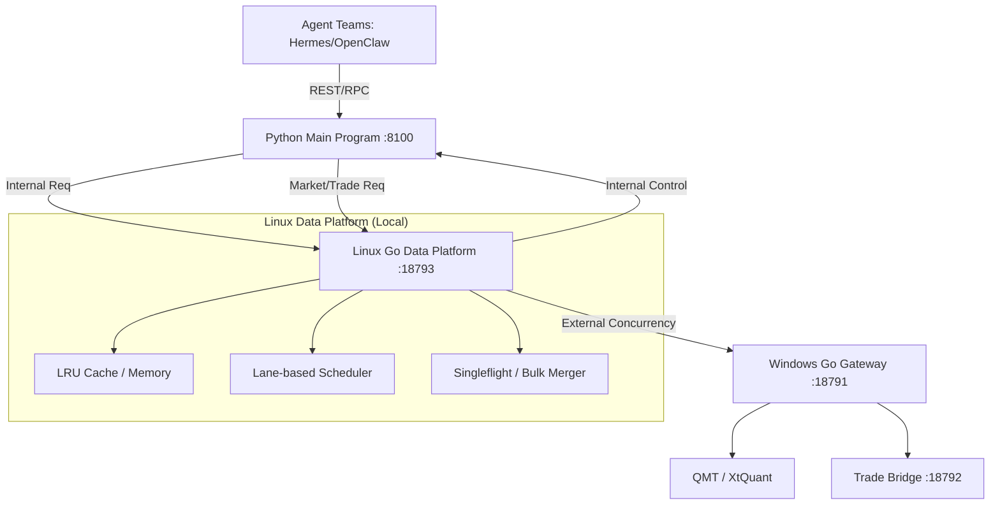

# ashare-system-v2 Linux 侧 Go 并发数据平台技术方案

## 1. 目标与边界 (Objectives & Boundaries)

### 1.1 目标
- **解决 Linux 侧并发瓶颈**：通过 Go 协程模型，解决当前 Python 多 Agent 并发请求 Windows 数据面及内部服务时的阻塞与延迟问题。
- **建立统一数据客户端**：在 Linux 本地提供一个具备缓存、聚合、调度能力的统一入口，作为 Python 主程序的所有数据请求中转站。
- **对接 Windows Go 网关**：充分利用 Windows 侧已有的三层 lane 调度能力，在 Linux 侧实现对应的客户端调度与流控。
- **内部服务治理**：将项目内部各服务（如 FastAPI, Scheduler）之间的互调纳入 Go 平台管理，实现统一的观测与熔断。

### 1.2 边界
- **Windows 侧**：维持现有 `18791` 端口 Go 网关实现，不进行重写。
- **Python 主程序**：保持现有 FastAPI 框架与业务逻辑，通过适配器层接入 Go 平台。
- **数据面与动作面隔离**：在 Linux 侧物理区分“只读查询”与“交易执行”流量，确保交易安全性。

## 2. 当前现状分析 (Current Status Analysis)

### 2.1 Windows 侧能力
- 已具备三层 lane（`quote`, `account_fast`, `trade_slow`）隔离。
- 支持排队与超时（`429` 保护）。
- 具备有限重试逻辑。

### 2.2 Linux 侧瓶颈
- **多 Agent 并发阻塞**：当多个 Agent 同时通过 Python 发起行情拉取或研究问询时，受限于 Python 的同步/半异步模型及单连接限制，容易出现互相等待。
- **缺乏本地缓存**：高频重复拉取相同标的的行情、基础信息（Instruments）或板块数据，全部打向 Windows 侧，造成带宽与计算资源浪费。
- **请求不可见性**：无法直观观测到每个 Agent 的请求频率、耗时分布及成功率。
- **内部调用杂乱**：服务间互调缺乏统一的超时控制与熔断机制。

## 3. 总体架构方案 (System Architecture)

## 4. Linux 本地 Go 并发请求平台设计 (Detailed Design)

### 4.1 部署与形态
- **进程形态**：独立 Daemon 进程，由 `systemd` 管理。
- **暴露方式**：推荐 **HTTP (127.0.0.1:18793)**。考虑到 Python 开发便利性与跨语言调用成本，HTTP 是最稳健的选择。备选 Unix Domain Socket。
- **部署位置**：`/srv/projects/ashare-system-v2/go_data_platform`。

### 4.2 内部调度模型 (Scheduling Model)
采用 **Lane + Worker Pool + Priority Queue** 模型：
1.  **`quote` Lane**：极速抢占，多 Worker，用于 Tick/Bar 拉取。
2.  **`account_fast` Lane**：中等优先级，用于资产/持仓快查。
3.  **`trade_slow` Lane**：低优先级，长超时，用于订单/成交/撤单。
4.  **`internal` Lane**：用于服务间调用，配置独立的熔断阈值。
5.  **`bulk_metadata` Lane**：用于冷数据（代码表、板块成员）的批量拉取。

### 4.3 核心能力组件
- **Singleflight (请求合并)**：对于同一毫秒内多个 Agent 发起的同一标的行情请求，只发一起请求到 Windows 侧，结果共享。
- **短时缓存 (Stale-while-revalidate)**：
    - `tick`: 1-3s 缓存。
    - `kline`: 10-60s 缓存。
    - `instruments/sectors`: 1-hour 缓存。
    - `positions/asset`: 5-10s 缓存（交易期间缩短）。
- **Agent 画像注入**：要求 Python 侧请求头携带 `X-Agent-ID`, `X-Session-ID`，Go 平台据此进行配额限制与统计。

## 5. 并发与调度策略建议 (Concurrency Strategy)

| 配置项 | `quote` | `account_fast` | `trade_slow` | `internal` |
| --- | --- | --- | --- | --- |
| **Workers** | 16 | 8 | 4 | 12 |
| **Queue Size** | 64 | 32 | 16 | 48 |
| **Queue Timeout** | 2000ms | 5000ms | 15000ms | 3000ms |
| **Retries** | 2 | 1 | 0 | 1 |
| **Max Conn/Host** | 32 | 16 | 8 | -- |

## 6. 请求协议增强 (Protocol Enhancement)

Linux Go 平台支持在 Header 中接收以下增强字段：
- `X-Ashare-Trace-ID`: 全链路追踪 ID。
- `X-Ashare-Priority`: `high | medium | low`，显式指定 Lane。
- `X-Ashare-Freshness`: `max-age=N`，强制缓存有效期控制。
- `X-Ashare-Agent-ID`: 发起请求的 Agent 标识。

返回包将扩展 `metadata` 字段：
- `_meta.queue_wait_ms`: 在 Linux 侧排队耗时。
- `_meta.upstream_cost_ms`: Windows 侧往返耗时。
- `_meta.cache_hit`: 是否命中本地缓存。

## 7. 数据一致性与风控边界 (Consistency & Risk Control)

- **只读保护**：除 `/qmt/trade/order` 及其状态更新外，所有接口默认进入 Read-Only 模式处理。
- **幂等强化**：交易类请求必须强制携带 `X-Ashare-Idempotency-Key`，Go 平台在 1 分钟内拒绝重复的 Key，防止网络抖动导致的重复下单。
- **读一致性**：当检测到 `trade_slow` 有成交回报时，自动作废本地 `account_fast` 缓存，强制拉取最新资产。

## 8. 可观测性 (Observability)

- **Prometheus Metrics**：暴露 `/metrics` 接口，包含 `request_total`, `latency_bucket`, `cache_hit_ratio`。
- **Lane Dashboard**：实时监控四个 Lane 的队列深度与 Worker 繁忙度。
- **Audit Logging**：对所有状态变更类请求（POST）进行审计日志落盘。

## 9. 故障与降级 (Fault Tolerance)

- **Windows 断连**：Go 平台进入“熔断态”，立即返回 `503` 并由 Python 侧降级为 `mock`（非实盘）或 `last-cached` 数据。
- **Go 平台重启**：Python 适配器需支持直连 Windows 网关的 Fallback 路径（通过配置开关）。

## 10. 接线方案 (Integration)

1.  **新增适配器**：`GoPlatformMarketDataAdapter`。
2.  **配置切换**：修改 `.env` 中的 `ASHARE_MARKET_MODE=go_platform`。
3.  **逐步切流**：
    - 第一步：行情数据切换到 Go 平台。
    - 第二步：资产与持仓查询切换。
    - 第三步：内部服务调用（如研究底稿查询）切换。
    - 第四步：交易指令正式接通。

## 11. 实施计划 (Implementation Plan)

- **P0 (Day 1)**: 环境初始化，实现基础的 HTTP Proxy 与 Lane 调度框架。
- **P1 (Day 1)**: 实现 Singleflight 与行情短时缓存。
- **P2 (Day 2)**: 实现交易幂等保护与 Agent 画像监控。
- **P3 (Day 2)**: 交付监控面板，完成全链路联调与 P95 性能压测。

## 12. 交付清单 (Deliverables)
- `go_data_platform/` 源代码包。
- `src/ashare_system/infra/go_client.py` 适配层。
- `deploy/systemd/ashare-go-data-platform.service` 配置文件。
- 详细的 `v2_go_platform_api.md` 接口文档。

## 13. 验收标准 (Acceptance Criteria)
- 10 个 Agent 同时并发请求同一组 K 线时，Windows 侧实收请求数应显著下降（验证 Singleflight）。
- 模拟 20 个并发下单请求，系统无崩溃且 P95 延迟增长受控（验证 Lane 隔离）。
- 强行杀掉 Windows 网关进程，Linux 侧 Agent 应能收到明确的 503 且系统不陷入死循环。
