# ashare-system-v2 框架代码工程交接文档

> 交接日期: 2026-04-12
> 语法检查: **20/20 全部通过** ✅ (19 Python + 1 JSON)

---

## 一、本次交付物清单

### 新建文件（7 个）

| 文件 | 行数 | 模块 | 完成度 |
|------|------|------|--------|
| [auction_fetcher.py](file:///srv/projects/ashare-system-v2/src/ashare_system/data/auction_fetcher.py) | ~130 | A·竞价数据抓取 | 框架 ⬜ 数据源 TODO |
| [auction_engine.py](file:///srv/projects/ashare-system-v2/src/ashare_system/strategy/auction_engine.py) | ~155 | A·竞价研判引擎 | **已实现** ✅ |
| [micro_rhythm.py](file:///srv/projects/ashare-system-v2/src/ashare_system/monitor/micro_rhythm.py) | ~190 | B·微观节奏追踪 | **已实现** ✅ |
| [event_bus.py](file:///srv/projects/ashare-system-v2/src/ashare_system/data/event_bus.py) | ~140 | D·事件总线 | **已实现** ✅ |
| [prompt_patcher.py](file:///srv/projects/ashare-system-v2/src/ashare_system/learning/prompt_patcher.py) | ~220 | F·Prompt 自进化 | **已实现** ✅ |
| [registry_updater.py](file:///srv/projects/ashare-system-v2/src/ashare_system/learning/registry_updater.py) | ~140 | F·注册表覆写 | **已实现** ✅ |
| [nightly_sandbox.py](file:///srv/projects/ashare-system-v2/src/ashare_system/strategy/nightly_sandbox.py) | ~175 | G·夜间沙盘 | 框架 ⬜ 模拟逻辑 TODO |

### 修改文件（12 个）

| 文件 | 改动要点 |
|------|---------|
| [contracts.py](file:///srv/projects/ashare-system-v2/src/ashare_system/contracts.py) | +128 行，8 个 Pydantic 模型 + 3 个 Literal |
| [state_machine.py](file:///srv/projects/ashare-system-v2/src/ashare_system/discussion/state_machine.py) | 重写: 动态轮次 `start_round(n)` / `can_continue_discussion()` |
| [discussion_service.py](file:///srv/projects/ashare-system-v2/src/ashare_system/discussion/discussion_service.py) | DiscussionCycle +3 字段，start_round 移除硬限，refresh_cycle 自动续轮 |
| [contradiction_detector.py](file:///srv/projects/ashare-system-v2/src/ashare_system/discussion/contradiction_detector.py) | +80 行 `detect_evidence_conflicts()` + 9 对关键词对立表 |
| [finalizer.py](file:///srv/projects/ashare-system-v2/src/ashare_system/discussion/finalizer.py) | `build_finalize_bundle()` 新增 `agent_weights` 参数 |
| [opinion_validator.py](file:///srv/projects/ashare-system-v2/src/ashare_system/discussion/opinion_validator.py) | `round == 2` → `round >= 2` 泛化 |
| [auto_governance.py](file:///srv/projects/ashare-system-v2/src/ashare_system/learning/auto_governance.py) | +96 行 `build_agent_lesson_patches()` 归因→教训 |
| [score_state.py](file:///srv/projects/ashare-system-v2/src/ashare_system/learning/score_state.py) | +57 行 `export_weights()` + `run_daily_settlement()` |
| [sell_decision.py](file:///srv/projects/ashare-system-v2/src/ashare_system/strategy/sell_decision.py) | 重写核心: Playbook-aware + Regime-aware 动态退出参数 |
| [buy_decision.py](file:///srv/projects/ashare-system-v2/src/ashare_system/strategy/buy_decision.py) | `generate()` 新增 `auction_signals`，KILL 过滤 / PROMOTE +20 分 |
| [exit_engine.py](file:///srv/projects/ashare-system-v2/src/ashare_system/strategy/exit_engine.py) | `check()` 新增 `micro_signal`，PEAK_FADE/RHYTHM_BREAK/VALLEY_HOLD 处理 |
| [freshness.py](file:///srv/projects/ashare-system-v2/src/ashare_system/data/freshness.py) | +30 行 `tag_freshness()` 数据时效标签 |

### 修改配置文件（1 个）

| 文件 | 改动要点 |
|------|---------|
| [team_registry.final.json](file:///srv/projects/ashare-system-v2/openclaw/team_registry.final.json) | 新增 `agent_weights` 节点（4 个 Agent 初始权重 1.0） |

---

## 二、新增数据模型速查

```python
# 集合竞价
AuctionAction    = Literal["PROMOTE", "HOLD", "DEMOTE", "KILL"]
AuctionSnapshot  # symbol, price, volume, prev_close, prev_volume_5d_avg, open_change_pct
AuctionSignal    # symbol, action, reason, auction_volume_ratio, open_change_pct, playbook

# 微观节奏
MicroSignalType  = Literal["PEAK_FADE", "VALLEY_HOLD", "RHYTHM_BREAK"]
MicroBarSnapshot # symbol, open, high, low, close, volume, timestamp
MicroSignal      # symbol, signal_type, strength, timestamp, bar_count

# 事件总线
EventType        = Literal["NEGATIVE_NEWS", "PRICE_ALERT", "AUCTION_SIGNAL", ...]
MarketEvent      # event_type, symbol, payload, timestamp, priority, source

# 夜间沙盘
SandboxResult    # trade_date, tomorrow_priorities, missed_opportunities, simulation_log

# 自进化
Lesson           # text, source, agent_id, created_at, expires_at
PatchResult      # agent_id, lessons_before, lessons_after, added, removed, error

# 数据时效
DataFreshnessLevel = Literal["REALTIME", "NEAR_REALTIME", "DELAYED", "STALE"]
```

---

## 三、剩余 TODO 汇总

### 🔴 必须补全（系统上线前）

| # | 文件 | TODO | 说明 |
|---|------|------|------|
| 1 | `auction_fetcher.py` | `_fetch_from_gateway()` | HTTP 调用 Windows Gateway |
| 2 | `auction_fetcher.py` | `_fetch_from_akshare()` | akshare 数据适配 |
| 3 | `scheduler.py` | 注册 7 个新 cron 任务 | 竞价×2 + 微观巡检 + 盘后×3 + 夜间沙盘 |
| 4 | `discussion_service.py` | `finalize_cycle()` 调 `export_weights()` | 加权投票闭环 |

### 🟡 功能深化

| # | 文件 | TODO | 说明 |
|---|------|------|------|
| 5 | `event_fetcher.py` | `fetch_incremental()` | 增量抓取 + 事件发射 |
| 6 | `market_watcher.py` | 价格异动 → `PRICE_ALERT` | 事件总线对接 |
| 7 | `nightly_sandbox.py` | `_simulate_param_adjustment()` | 参数模拟逻辑 |
| 8 | `self_evolve.py` | scheduler 17:15 接入 | 策略权重建议 |
| 9 | `continuous.py` | scheduler 17:30 接入 | 增量训练 |

### 🔵 数据层整固

| # | 文件 | TODO | 说明 |
|---|------|------|------|
| 10 | `precompute.py` | `as_of_time` 参数 | 截面保障 |
| 11 | `serving.py` | `as_of_time` 过滤 | 数据一致性 |

---

## 四、模块间调用关系图

```mermaid
graph TB
    subgraph "数据层"
        AF["auction_fetcher<br/>竞价快照"]
        EB["event_bus<br/>事件总线"]
        FR["freshness<br/>时效标签"]
    end

    subgraph "策略层"
        AE["auction_engine<br/>竞价研判"]
        BD["buy_decision<br/>买入决策"]
        SD["sell_decision<br/>卖出决策"]
        EE["exit_engine<br/>退出引擎"]
        NS["nightly_sandbox<br/>夜间沙盘"]
    end

    subgraph "监控层"
        MR["micro_rhythm<br/>微观节奏"]
    end

    subgraph "讨论层"
        SM["state_machine<br/>动态轮次"]
        CD["contradiction_detector<br/>证据矛盾"]
        FN["finalizer<br/>加权投票"]
        DS["discussion_service<br/>讨论主控"]
        OV["opinion_validator<br/>意见校验"]
    end

    subgraph "学习层"
        SS["score_state<br/>学分结算"]
        AG["auto_governance<br/>归因治理"]
        PP["prompt_patcher<br/>Prompt进化"]
        RU["registry_updater<br/>注册表覆写"]
    end

    AF -->|AuctionSnapshot| AE
    AE -->|AuctionSignal| BD
    MR -->|MicroSignal| EE
    SD -->|playbook params| EE
    EB -.->|NEGATIVE_NEWS| EE
    EB -.->|PRICE_ALERT| MR
    NS -->|tomorrow_priorities| BD

    SM -->|can_continue| DS
    CD -->|evidence_conflicts| DS
    OV -->|round >= 2| DS
    SS -->|export_weights| FN
    FN -->|agent_weights| DS

    SS -->|score_states| AG
    AG -->|lesson_patches| PP
    SS -->|weight_values| RU

    style AF fill:#e74c3c,color:white
    style AE fill:#27ae60,color:white
    style MR fill:#27ae60,color:white
    style EB fill:#27ae60,color:white
    style PP fill:#27ae60,color:white
    style RU fill:#27ae60,color:white
    style NS fill:#e74c3c,color:white
    style SM fill:#27ae60,color:white
    style CD fill:#27ae60,color:white
    style FN fill:#27ae60,color:white
    style SD fill:#27ae60,color:white
    style BD fill:#27ae60,color:white
    style EE fill:#27ae60,color:white
    style SS fill:#27ae60,color:white
    style AG fill:#27ae60,color:white
    style OV fill:#27ae60,color:white
    style FR fill:#27ae60,color:white
    style DS fill:#f39c12,color:white
```



**绿色 = 核心逻辑已实现** | **红色 = 框架在，核心 TODO 待补** | **黄色 = 已改但需接线**

---

## 五、快速验证手册

### 5.1 全量语法检查（已通过 ✅）
```bash
python3 -c "
import ast, json
files = [
    'src/ashare_system/contracts.py','src/ashare_system/data/auction_fetcher.py',
    'src/ashare_system/data/event_bus.py','src/ashare_system/data/freshness.py',
    'src/ashare_system/strategy/auction_engine.py','src/ashare_system/strategy/sell_decision.py',
    'src/ashare_system/strategy/buy_decision.py','src/ashare_system/strategy/exit_engine.py',
    'src/ashare_system/strategy/nightly_sandbox.py','src/ashare_system/monitor/micro_rhythm.py',
    'src/ashare_system/discussion/state_machine.py','src/ashare_system/discussion/contradiction_detector.py',
    'src/ashare_system/discussion/finalizer.py','src/ashare_system/discussion/discussion_service.py',
    'src/ashare_system/discussion/opinion_validator.py','src/ashare_system/learning/auto_governance.py',
    'src/ashare_system/learning/score_state.py','src/ashare_system/learning/prompt_patcher.py',
    'src/ashare_system/learning/registry_updater.py',
]
for f in files:
    with open(f) as fh: ast.parse(fh.read()); print(f'✓ {f}')
with open('openclaw/team_registry.final.json') as fh: json.load(fh); print('✓ team_registry.final.json')
print('All checks passed ✅')
"
```

### 5.2 单模块功能验证

**竞价引擎**（核心已实现，可直接测试）:
```python
from src.ashare_system.contracts import AuctionSnapshot
from src.ashare_system.strategy.auction_engine import AuctionEngine
eng = AuctionEngine()
snap = AuctionSnapshot(symbol="000001.SZ", price=15.0, volume=50000,
                       prev_close=14.5, prev_volume_5d_avg=80000, open_change_pct=0.0345)
assert eng.evaluate_auction_snapshot(snap, "leader_chase").action == "PROMOTE"
snap_kill = AuctionSnapshot(symbol="000002.SZ", price=14.0, volume=5000,
                            prev_close=14.5, prev_volume_5d_avg=80000, open_change_pct=-0.0345)
assert eng.evaluate_auction_snapshot(snap_kill, "leader_chase").action == "KILL"
```

**微观节奏**（三种信号检测均已实现）:
```python
from src.ashare_system.contracts import MicroBarSnapshot
from src.ashare_system.monitor.micro_rhythm import MicroRhythmTracker
tracker = MicroRhythmTracker()
bar1 = MicroBarSnapshot(symbol="X", open=15.0, high=15.2, low=14.8, close=15.1, volume=1000)
bar2 = MicroBarSnapshot(symbol="X", open=15.1, high=15.5, low=14.7, close=14.9, volume=800)
tracker.push_bar(bar1)
signal = tracker.push_bar(bar2)
assert signal and signal.signal_type == "PEAK_FADE"
```

**动态讨论轮次**:
```python
from src.ashare_system.discussion.state_machine import DiscussionStateMachine as SM
assert SM.start_round(3) == ("execution_pool_building", "round_running")
assert SM.can_continue_discussion({"remaining_disputes": ["x"]}, 2, max_rounds=3) is True
assert SM.can_continue_discussion({"remaining_disputes": ["x"]}, 3, max_rounds=3) is False
```

**Playbook-aware 止损**:
```python
from src.ashare_system.strategy.sell_decision import SellDecisionEngine
eng = SellDecisionEngine()
p_leader = eng._resolve_params("leader_chase", "")
p_reflow = eng._resolve_params("sector_reflow_first_board", "")
assert p_leader["atr_stop_mult"] == 1.5   # 龙头票止损紧
assert p_reflow["atr_stop_mult"] == 2.5   # 首板票止损松
p_chaos = eng._resolve_params("leader_chase", "chaos")
assert p_chaos["atr_stop_mult"] == 1.5 * 0.8  # chaos 再收紧
```

---

## 六、向后兼容保障

| 改动点 | 兼容处理 |
|--------|---------|
| `state_machine` `start_round_1/2()` | 保留为 `start_round(1/2)` 的快捷方法 |
| `discussion_service.start_round()` | 移除 `ValueError`，Round 3+ 走泛化路径 |
| `sell_decision.evaluate()` | 新增 `playbook=""`, `regime=""` 默认值 |
| `exit_engine.check()` | 新增 `micro_signal=None` 默认值 |
| `buy_decision.generate()` | 新增 `auction_signals=None` 默认值 |
| `finalizer.build_finalize_bundle()` | 新增 `agent_weights=None` 默认值 |
| `opinion_validator` | `round == 2` → `round >= 2`，向前无影响 |
| `DiscussionCycle` | 新增 3 个有默认值的字段 |
| `team_registry.final.json` | 新增不影响现有解析 |

所有现有调用点**无需任何修改**即可继续工作。

---

## 七、接力开发建议

### 推荐开工顺序（最短路径出闭环）

**第 1 步（半天）— 跑通盘后闭环**:
1. 在 `scheduler.py` 注册 3 个盘后任务（16:30 学分结算 / 16:45 Prompt 自进化 / 17:00 注册表刷新）
2. 在 `discussion_service.finalize_cycle()` 中调 `score_state.export_weights()` 传给 finalizer
3. 手动执行一次完整盘后流程验证

**第 2 步（半天）— 竞价数据层**:
4. 实现 `auction_fetcher._fetch_from_akshare()`（Gateway 可后补）
5. 在 `scheduler.py` 注册 09:20 + 09:24 竞价任务

**第 3 步（1 天）— 事件总线接线**:
6. 在 `scheduler.py.__init__()` 初始化 EventBus 并注册响应链
7. 在 `event_fetcher.py` 和 `market_watcher.py` 中加事件发射

**第 4 步（半天）— 收尾**:
8. `nightly_sandbox._simulate_param_adjustment()` 模拟逻辑
9. `precompute.py` as_of_time 截面保障

### ⚠️ 关键注意事项

> [!CAUTION]
> `prompt_patcher.py` 的安全约束（`MAX_LESSONS=10`, `MAX_LESSON_CHARS=200`）是**硬编码**的，
> 绝不能被自进化逻辑覆盖。如需调整只能手动改源码。

> [!WARNING]
> `scheduler.py` 是 2601 行巨石文件，建议在改之前 `git tag v0.9-pre-upgrade` 做快照。
> 新增的 7 个 cron 任务建议集中放在文件顶部的任务定义区。

> [!IMPORTANT]
> `discussion_service.py` 的 `refresh_cycle()` 现在会**自动续轮** —
> 当 `can_continue_discussion()` 返回 True 时自动进入 Round N+1。
> 这意味着如果 Agent 回复中频繁包含 `remaining_disputes`，讨论可能会走满 `max_rounds=3` 轮。
> 可以通过调整 `DiscussionCycle.max_rounds` 控制上限。
